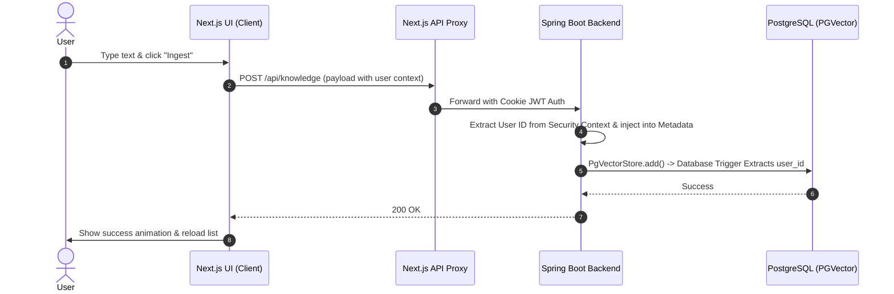

# Feature Plan: Frontend Knowledge Base Management UI

This plan outlines the frontend implementation for the Knowledge Base Management UI in Next.js, allowing the user to upload documents, paste text notes, view ingested snippets, and perform semantic (vector similarity) search.

- **Source Checkbox**: `MyOS_TODO.md` -> `- [ ] Frontend: Build knowledge base management UI (upload docs, view snippets)`

---

## Goal and User Value
Provide MyOS with a sleek, premium, and highly interactive user interface to manage its "long-term memory". Users can:
1. View a list of their ingested knowledge snippets (notes, emails, docs).
2. Manually ingest raw text, choose categories/sources, and add custom metadata tags.
3. Perform **Semantic Vector Search** directly inside the UI, witnessing the PGVector similarity matching in real-time.
4. Delete snippets from the vector store to clean up memory.

---

## Scope
- **Knowledge Dashboard Route**: A new protected route at `/dashboard/knowledge` in the Next.js App Router.
- **Ingestion Panel**: Form with validation for content, source, and metadata fields.
- **Search Panel**: Interactive search input displaying semantic match scores (similarity ratings).
- **Snippet List**: A responsive grid of card components highlighting metadata badges, formatted dates, and a delete action.
- **Backend API additions**:
  - Add search and retrieval support to allow listing and query operations for the user.
  - Implement a PostgreSQL trigger to automatically extract `user_id` from Spring AI `metadata` JSONB to satisfy the `NOT NULL` constraint on `knowledge_base.user_id`.

---

## Out of Scope
- File/PDF upload parser (handled in future phases; currently limited to text note submissions).
- Editing existing snippets (delete and re-create is the standard vector store pattern).

---

## System Architecture & Flow



---

## Technical Specs & Changes

### 1. Database (PostgreSQL Migration)
To enable the Spring AI `PgVectorStore` to write successfully without hitting `null value in column "user_id" violates not-null constraint`, we introduce a migration with a database trigger:

```sql
-- V12__add_knowledge_user_id_trigger.sql
CREATE OR REPLACE FUNCTION set_knowledge_base_user_id()
RETURNS TRIGGER AS $$
BEGIN
    IF NEW.user_id IS NULL AND NEW.metadata->>'user_id' IS NOT NULL THEN
        NEW.user_id := (NEW.metadata->>'user_id')::uuid;
    END IF;
    RETURN NEW;
END;
$$ LANGUAGE plpgsql;

CREATE OR REPLACE TRIGGER trg_set_knowledge_base_user_id
BEFORE INSERT ON knowledge_base
FOR EACH ROW
EXECUTE FUNCTION set_knowledge_base_user_id();
```

### 2. Backend Changes (Spring Boot)

#### A. `KnowledgeIngestionService.java` [MODIFY]
Update the `inject` method to resolve the current authenticated user's ID and inject it into the metadata.
```java
// Retrieve authenticated user details
UserPrincipal userPrincipal = (UserPrincipal) SecurityContextHolder.getContext().getAuthentication().getPrincipal();
UUID userId = userPrincipal.getId();

// Populate metadata
Map<String, Object> docMetadata = new HashMap<>();
docMetadata.put("user_id", userId.toString());
if (request.getSource() != null) docMetadata.put("source", request.getSource());
if (request.getMetadata() != null) docMetadata.putAll(request.getMetadata());

Document document = new Document(request.getContent(), docMetadata);
vectorStore.add(List.of(document));
```

#### B. `KnowledgeController.java` [MODIFY]
Add `GET` and `DELETE` endpoints to support the UI:
- `GET /api/knowledge`: Query all knowledge snippets for the authenticated user (semantic search or simple retrieval).
- `DELETE /api/knowledge/{id}`: Delete a snippet from the vector store.

---

### 3. Frontend Changes (Next.js)

#### A. Services
- **`src/services/knowledge.service.ts` [NEW]**: Exposes `ingest()`, `search()`, and `deleteSnippet()`.

#### B. App Router
- **`src/app/dashboard/knowledge/page.tsx` [NEW]**: Layout combining the search bar, the ingestion modal/panel, and the grid of snippets.

#### C. Components
- **`src/components/knowledge/IngestForm.tsx` [NEW]**: A beautiful card component with advanced glassmorphism styles, animated load state, and form field validations.
- **`src/components/knowledge/SnippetCard.tsx` [NEW]**: Displays each knowledge segment, category badges, source icons, content preview, similarity score, and a delete action.

---

## API Contracts

### 1. `GET /api/knowledge`
Retrieves the user's knowledge snippets or filters them via semantic search.
- **Query Params**:
  - `query` (optional String): Search query.
  - `limit` (optional Integer, default = 20): Maximum records.
- **Response (200 OK)**:
```json
[
  {
    "id": "c88f28f1-a1e4-4d8e-9d22-25de75be351b",
    "content": "My favorite programming language is TypeScript.",
    "metadata": {
      "source": "note",
      "category": "personal",
      "user_id": "a50c3de4-912f-410a-b1c4-110de836cb12"
    },
    "similarityScore": 0.89
  }
]
```

### 2. `DELETE /api/knowledge/{id}`
Deletes a knowledge snippet by ID.
- **Response (200 OK)**: Empty body.

---

## Security & Privacy
- **User Separation**: Similarity search must filter by the authenticated user's ID to prevent cross-user data leakage.
- **API Protection**: The controller endpoint relies on Spring Security JWT filter and blocks unauthenticated calls with a `401 Unauthorized` status.

---

## Verification Plan

### Automated Verification
- Run tests on `KnowledgeIngestionService` and verify vector operations.
- Verify `vectorStore.similaritySearch` works with metadata filters.

### Manual Verification
- Ingest a snippet: "Meeting with Sarah next Monday at 2 PM".
- Perform a search for: "When is my meeting?" and verify the similarity score and text return successfully.
- Perform a deletion and verify the snippet no longer appears.

---

## Acceptance Criteria
- [ ] Users can type and ingest notes with source & category options.
- [ ] The UI renders existing knowledge elements in a responsive grid.
- [ ] The semantic search returns actual similarity match ratings.
- [ ] Users can delete a snippet, and it updates the UI immediately.
- [ ] Code follows Next.js 19 and Tailwind standard system tokens.

---

## Open Questions
- Do we want a visual indicator of similarity score range? (Yes, we will color-code similarity percentages: high match = green, medium match = yellow).
